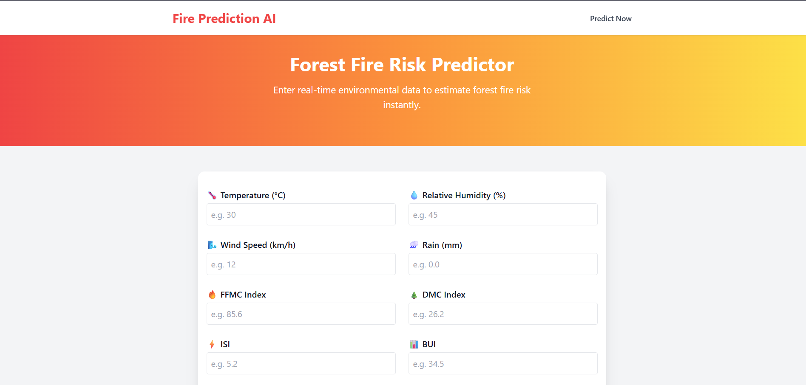

# 🔥 Algerian Forest Fire Predictor

A lightweight web app that predicts **Fire Weather Index (FWI)** using environmental data from the **Algerian Forest Fire Dataset**.

### ⚙️ Tech Stack
- 🧠 Ridge Regression (ML)
- 🧪 StandardScaler
- 🌐 Flask + Tailwind CSS

### 📌 Features
- Predict fire risk based on inputs like temperature, humidity, wind, and more
- Clean, responsive UI
- Specifically trained on Algerian forest data

### 🛠️ How to Use
1. Clone this repo  
2. Install dependencies  
3. Run `python app.py`  
4. Visit `http://localhost:5000/` and predict!

---

🧠 Dataset: [UCI Algerian Forest Fires](https://archive.ics.uci.edu/ml/datasets/Algerian+Forest+Fires+Dataset)  
✨ Built with love and learning by Saturn
